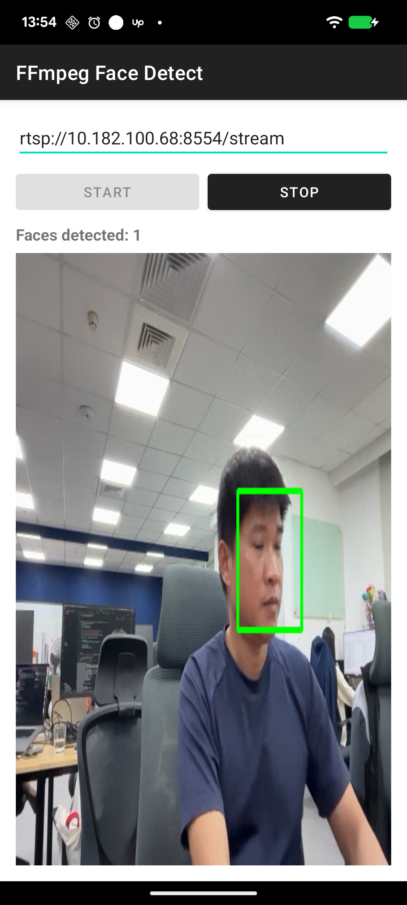

# FFmpeg Face Detect - Android RTSP Face Detection POC

A native Android app using **C++ (NDK)** to receive an **RTSP** video stream via **FFmpeg**, run **face detection** on each frame using **OpenCV**, and display the annotated video in real-time.

## Screenshot

<p align="center">
  
</p>

## What This Demonstrates

- **FFmpeg RTSP Decoding**: Native C++ RTSP stream handling with H.264/H.265 codec support via `libavformat` and `libavcodec`
- **OpenCV Face Detection**: Real-time Haar cascade face detection on decoded video frames
- **Android NDK + JNI**: Clean C++/Kotlin boundary with proper JNI bridge architecture
- **Video Pipeline**: Decode -> Convert -> Detect -> Render pipeline running on background thread
- **ANativeWindow Rendering**: Direct frame rendering to Android Surface from C++ layer
- **Frame Conversion**: Efficient YUV420P to RGB/RGBA conversion using FFmpeg's `sws_scale`

## Architecture

```
┌──────────────────────────────────────────────────────────────┐
│                        Android App (Kotlin)                   │
│  ┌─────────────┐  ┌──────────────┐  ┌─────────────────────┐ │
│  │ MainActivity │  │ NativeBridge │  │  VideoSurfaceView   │ │
│  │  (UI/Input)  │──│    (JNI)     │  │  (Frame Display)    │ │
│  └─────────────┘  └──────┬───────┘  └─────────────────────┘ │
└───────────────────────────┼──────────────────────────────────┘
                            │ JNI
┌───────────────────────────┼──────────────────────────────────┐
│                      C++ Native Layer                         │
│                                                               │
│  ┌────────────────────────▼─────────────────────────────┐    │
│  │                  VideoPipeline                        │    │
│  │  Orchestrates decode -> convert -> detect -> render   │    │
│  └──┬──────────────┬──────────────┬─────────────────┬───┘    │
│     │              │              │                  │        │
│  ┌──▼──────────┐ ┌─▼───────────┐ ┌▼──────────────┐ │        │
│  │ RtspDecoder │ │  Frame      │ │ FaceDetector  │ │        │
│  │  (FFmpeg)   │ │  Converter  │ │  (OpenCV)     │ │        │
│  │             │ │  (swscale)  │ │  Haar Cascade │ │        │
│  │ avformat    │ │             │ │               │ │        │
│  │ avcodec     │ │ YUV -> RGB  │ │ detect()      │ │        │
│  │ RTSP/TCP    │ │ RGB -> RGBA │ │ draw_faces()  │ │        │
│  └─────────────┘ └─────────────┘ └───────────────┘ │        │
│                                                     │        │
│                                          ┌──────────▼─────┐  │
│                                          │  ANativeWindow  │  │
│                                          │  (Surface)      │  │
│                                          └────────────────┘  │
└──────────────────────────────────────────────────────────────┘
```

## Data Flow

```
RTSP Stream (H.264/H.265)
    │
    ▼
RtspDecoder::decode_loop()
    │  avformat_open_input() + avcodec_send_packet/receive_frame
    │  Output: AVFrame (YUV420P)
    ▼
FrameConverter::convert()
    │  sws_scale (YUV420P -> RGB24)
    │  Output: cv::Mat (RGB)
    ▼
FaceDetector::detect()
    │  Haar cascade detectMultiScale
    │  Output: vector<FaceRect>
    ▼
FaceDetector::draw_faces()
    │  cv::rectangle on detected faces
    │  Output: cv::Mat (RGB with bounding boxes)
    ▼
VideoPipeline::render_to_surface()
    │  RGB -> RGBA, memcpy to ANativeWindow buffer
    │  Output: displayed frame on screen
```

## Project Structure

```
app/src/main/
├── java/com/trungnt/ffmpegface/
│   ├── MainActivity.kt          # UI: RTSP URL input, start/stop, face count display
│   ├── VideoSurfaceView.kt      # Custom SurfaceView for native frame rendering
│   └── NativeBridge.kt          # JNI bridge - startStream, stopStream, getFaceCount
├── cpp/
│   ├── CMakeLists.txt            # NDK build: links FFmpeg + OpenCV prebuilt libs
│   ├── native_bridge.cpp         # JNI entry points -> VideoPipeline
│   ├── rtsp_decoder.cpp/.h       # FFmpeg RTSP stream open/decode (TCP, 5s timeout)
│   ├── face_detector.cpp/.h      # OpenCV Haar cascade face detection + drawing
│   ├── video_pipeline.cpp/.h     # Pipeline orchestration + ANativeWindow rendering
│   └── frame_converter.cpp/.h    # YUV420P <-> RGB conversion via sws_scale
└── res/
    └── layout/activity_main.xml  # URL input, start/stop buttons, face count, surface
```

## Key Patterns

| Pattern | Implementation |
|---------|---------------|
| RTSP over TCP | `av_dict_set("rtsp_transport", "tcp")` for reliable streaming |
| Codec auto-detection | `avcodec_find_decoder` from stream parameters (H.264, H.265) |
| Background decode thread | `std::thread` with `std::atomic<bool>` for stop control |
| Thread-safe rendering | `std::mutex` guards ANativeWindow access |
| Zero-copy pipeline | Single `cv::Mat` flows through detect -> draw -> render |
| JNI lifecycle | C++ pipeline created/destroyed per start/stop cycle |

## Build Instructions

### Prerequisites

- Android Studio Hedgehog (2023.1) or later
- Android NDK r26+
- CMake 3.22.1+
- Min SDK 24, Target SDK 34

### FFmpeg Setup

Build FFmpeg for Android from source, or use prebuilt binaries.

**Build from source (macOS/Linux):**

```bash
# 1. Clone FFmpeg
git clone https://git.ffmpeg.org/ffmpeg.git
cd ffmpeg

# 2. Set NDK path
export ANDROID_NDK=/path/to/android-ndk  # e.g. ~/Library/Android/sdk/ndk/26.1.10909125

# 3. Build for arm64-v8a
./configure \
  --prefix=output/arm64-v8a \
  --target-os=android \
  --arch=aarch64 \
  --cpu=armv8-a \
  --enable-cross-compile \
  --cross-prefix=$ANDROID_NDK/toolchains/llvm/prebuilt/darwin-x86_64/bin/aarch64-linux-android- \
  --cc=$ANDROID_NDK/toolchains/llvm/prebuilt/darwin-x86_64/bin/aarch64-linux-android24-clang \
  --cxx=$ANDROID_NDK/toolchains/llvm/prebuilt/darwin-x86_64/bin/aarch64-linux-android24-clang++ \
  --sysroot=$ANDROID_NDK/toolchains/llvm/prebuilt/darwin-x86_64/sysroot \
  --enable-shared \
  --disable-static \
  --disable-doc \
  --disable-programs \
  --disable-everything \
  --enable-decoder=h264,hevc \
  --enable-demuxer=rtsp,rtp,sdp \
  --enable-protocol=tcp,udp,rtp \
  --enable-swscale \
  --enable-avformat \
  --enable-avcodec

make -j$(nproc) && make install

# 4. Build for armeabi-v7a
make clean
./configure \
  --prefix=output/armeabi-v7a \
  --target-os=android \
  --arch=arm \
  --cpu=armv7-a \
  --enable-cross-compile \
  --cross-prefix=$ANDROID_NDK/toolchains/llvm/prebuilt/darwin-x86_64/bin/armv7a-linux-androideabi- \
  --cc=$ANDROID_NDK/toolchains/llvm/prebuilt/darwin-x86_64/bin/armv7a-linux-androideabi24-clang \
  --cxx=$ANDROID_NDK/toolchains/llvm/prebuilt/darwin-x86_64/bin/armv7a-linux-androideabi24-clang++ \
  --sysroot=$ANDROID_NDK/toolchains/llvm/prebuilt/darwin-x86_64/sysroot \
  --enable-shared \
  --disable-static \
  --disable-doc \
  --disable-programs \
  --disable-everything \
  --enable-decoder=h264,hevc \
  --enable-demuxer=rtsp,rtp,sdp \
  --enable-protocol=tcp,udp,rtp \
  --enable-swscale \
  --enable-avformat \
  --enable-avcodec

make -j$(nproc) && make install
```

**Copy output to project:**

```bash
# Headers (same for both ABIs)
cp -r output/arm64-v8a/include/* app/src/main/cpp/third_party/ffmpeg/include/

# Shared libraries
cp output/arm64-v8a/lib/*.so app/src/main/cpp/third_party/ffmpeg/lib/arm64-v8a/
cp output/armeabi-v7a/lib/*.so app/src/main/cpp/third_party/ffmpeg/lib/armeabi-v7a/
```

**Expected structure:**

```
app/src/main/cpp/third_party/ffmpeg/
├── include/
│   ├── libavformat/
│   ├── libavcodec/
│   ├── libavutil/
│   └── libswscale/
└── lib/
    ├── arm64-v8a/
    │   ├── libavformat.so
    │   ├── libavcodec.so
    │   ├── libavutil.so
    │   └── libswscale.so
    └── armeabi-v7a/
        ├── libavformat.so
        ├── libavcodec.so
        ├── libavutil.so
        └── libswscale.so
```

### OpenCV Setup

Download [OpenCV Android SDK](https://opencv.org/releases/) and extract it:

```bash
# Download and extract OpenCV 4.9.0 Android SDK
wget https://github.com/opencv/opencv/releases/download/4.9.0/opencv-4.9.0-android-sdk.zip
unzip opencv-4.9.0-android-sdk.zip

# Copy SDK to project
cp -r OpenCV-android-sdk/sdk app/src/main/cpp/third_party/opencv/sdk
```

**Expected structure:**

```
app/src/main/cpp/third_party/opencv/
└── sdk/
    ├── native/
    │   ├── jni/              # OpenCVConfig.cmake lives here
    │   ├── staticlibs/
    │   │   ├── arm64-v8a/    # .a files for arm64
    │   │   └── armeabi-v7a/  # .a files for armv7
    │   └── 3rdparty/
    │       └── libs/
    │           ├── arm64-v8a/
    │           └── armeabi-v7a/
    └── etc/
        └── haarcascades/     # Face detection cascade XML files
```

### Build & Run

```bash
./gradlew assembleDebug
```

Or open in Android Studio and run the `app` configuration.

### Run on Android Device

1. Connect your Android device via USB and enable USB debugging:

```bash
# Verify device is connected
adb devices
```

2. Push the Haar cascade file to the device (required for face detection):

```bash
adb push app/src/main/cpp/third_party/opencv/sdk/etc/haarcascades/haarcascade_frontalface_alt.xml /data/local/tmp/
```

3. Build and install the app:

```bash
./gradlew installDebug
```

4. Launch the app:

```bash
adb shell monkey -p com.trungnt.ffmpegface -c android.intent.category.LAUNCHER 1
```

5. Enter your RTSP stream URL in the text field and tap **START**.

### Setting Up a Local RTSP Stream (macOS)

To test with your Mac's webcam as an RTSP source:

**Step 1: Install mediamtx (RTSP server)**

```bash
brew install mediamtx
```

**Step 2: Start the RTSP server**

```bash
/opt/homebrew/opt/mediamtx/bin/mediamtx /opt/homebrew/etc/mediamtx/mediamtx.yml
```

**Step 3: Stream your webcam (in a new terminal)**

```bash
ffmpeg -f avfoundation -framerate 30 -video_size 640x480 -i "0" \
  -c:v libx264 -preset ultrafast -tune zerolatency \
  -f rtsp rtsp://localhost:8554/stream
```

Or stream a test pattern (no webcam needed):

```bash
ffmpeg -re -f lavfi -i testsrc=size=640x480:rate=30 \
  -c:v libx264 -preset ultrafast -tune zerolatency \
  -f rtsp rtsp://localhost:8554/stream
```

**Step 4: Find your Mac's local IP**

```bash
ipconfig getifaddr en0
```

**Step 5: Connect from the Android app**

Enter `rtsp://<your-mac-ip>:8554/stream` in the app (e.g. `rtsp://10.182.100.68:8554/stream`).

> **Note:** Your Android device and Mac must be on the same WiFi network.

## Dependencies

| Library | Version | Purpose |
|---------|---------|---------|
| FFmpeg | 6.x | RTSP stream decoding (libavformat, libavcodec, libavutil, libswscale) |
| OpenCV | 4.x | Face detection (Haar cascade), image processing |
| Android NDK | r26+ | C++ compilation, JNI, ANativeWindow |
| Kotlin | 1.9.x | Android UI layer |

## RTSP Configuration

| Parameter | Value | Purpose |
|-----------|-------|---------|
| `rtsp_transport` | `tcp` | Reliable transport (vs UDP packet loss) |
| `stimeout` | `5000000` | 5-second connection timeout |
| Codecs | H.264, H.265 | Auto-detected from stream |

## Face Detection Parameters

| Parameter | Value | Purpose |
|-----------|-------|---------|
| Scale factor | 1.1 | Image pyramid scale step |
| Min neighbors | 3 | Required neighbor detections to confirm face |
| Min face size | 80x80 | Minimum face size in pixels |
| Cascade | Haar frontalface | OpenCV's pre-trained frontal face model |
